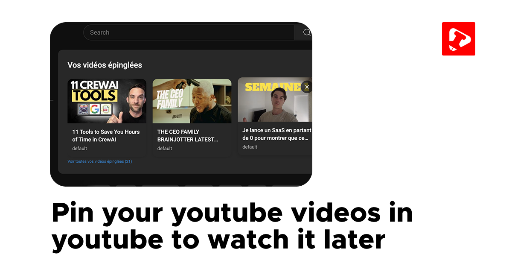

# YouTube Pin Extension

YouTube Pin is a powerful Chrome extension that allows you to pin your favorite YouTube videos directly on the platform, organize them with custom categories, and safely backup your data through import/export functionality.



## Features

- **Smart Pinning**: Keep your favorite videos accessible with one click, eliminating the need to search for them repeatedly.
- **Custom Categories**: Create your own themed playlists (music, learning, relaxation...) and organize your videos however you want.
- **Data Portability**: Export and import your pin data to keep your video collection across different devices.
- **Time-Saving**: No more cluttered tabs or repeated searches.
- **Personalized Experience**: Transform YouTube into your personal, intelligent content hub.

## Installation

1. Download from Chrome Web Store (coming soon)
2. Manual Installation:
   - Clone this repository
   - Open Chrome and go to `chrome://extensions/`
   - Enable "Developer mode"
   - Click "Load unpacked"
   - Select the extension directory

## Usage

1. Navigate to any YouTube video
2. Click the YouTube Pin icon in your browser
3. Pin the current video and assign it to a category
4. Access your pins through the extension popup
5. Export/Import your data through the settings menu

## Development

### Prerequisites

- Google Chrome
- Basic knowledge of JavaScript, HTML, and CSS

### Setup

1. Clone the repository:
```bash
git clone https://github.com/Leonelberio/youtube_pin.git
cd youtube-pin
```

2. Install dependencies:
```bash
npm install
```

3. Load the extension in Chrome:
   - Open Chrome
   - Go to `chrome://extensions/`
   - Enable "Developer mode"
   - Click "Load unpacked"
   - Select the `src` directory

### Project Structure

```
youtube-pin/
├── src/
│   ├── js/
│   │   ├── background.js
│   │   ├── content.js
│   │   ├── popup.js
│   │   └── newtab.js
│   ├── css/
│   │   └── styles.css
│   └── html/
│       ├── popup.html
│       └── newtab.html
├── assets/
│   └── images/
│       ├── icon16.png
│       ├── icon48.png
│       └── icon128.png
├── docs/
├── LICENSE
└── README.md
```

## Contributing

We welcome contributions! Please see our [Contributing Guidelines](CONTRIBUTING.md) for details.

### Development Process

1. Fork the repository
2. Create a feature branch
3. Make your changes
4. Submit a pull request

## License

This project is licensed under the MIT License - see the [LICENSE](LICENSE) file for details.

## Support

If you encounter any issues or have suggestions, please [open an issue](https://github.com/Leonelberio/youtube_pin/issues).
